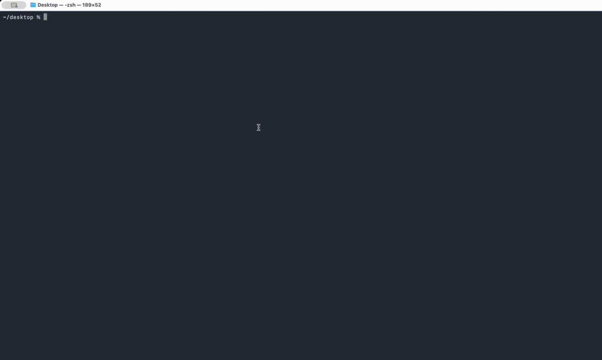

<p align="center">
  
</p>

<h1 align="center">CamelAGI</h1>

<p align="center">
  <strong>Open-source AI agent platform built on Claude Agent SDK + Cursor SDK.</strong><br>
  Alternative to OpenClaw — self-hosted, multi-runtime, multi-channel.
</p>

<p align="center">
  <a href="LICENSE"></a>
  <a href="https://www.typescriptlang.org"></a>
  <a href="https://platform.claude.com/docs/en/agent-sdk/overview"></a>
  <a href="https://cursor.com/docs/sdk/typescript"></a>
  <a href="https://core.telegram.org/bots"></a>
  <a href="https://camelagi.net"></a>
</p>

<p align="center">
  
  &nbsp;&nbsp;&nbsp;&nbsp;
  
</p>

<p align="center">
  Dual runtime: <strong>Claude Agent SDK</strong> + <strong>Cursor SDK</strong> — switch between them per session.
</p>

<p align="center">
  
</p>

---

## Install in 30 seconds

```bash
npm i -g camelagi
camel setup
camel serve
```

Use `/newagent` in Telegram to create your first AI agent.

---

## Why CamelAGI

- **Dual SDK runtime** — Claude Agent SDK + Cursor SDK, switchable per session
- Run Claude Code remotely from Telegram  
- Create and manage multiple AI agents  
- Self-hosted with full control  
- Multi-provider support (Anthropic, OpenRouter, or any OpenAI-compatible endpoint)
- Alternative to OpenClaw  

---

## Quick Start

> **Requirements:** Node.js 23+

| Install | Setup & Run | Update |
|:--------|:------------|:-------|
| `npm i -g camelagi` | `camel setup` | `camel update` |

```bash
camel setup
camel serve
camel chat
```

---

## Agent Modes

### 1. LLM Agent (API-based)

Uses your API key (Anthropic, OpenAI, OpenRouter, etc.) to run an AI agent through CamelAGI runtime.

1. Open admin bot in Telegram  
2. Send `/newagent`  
3. Pick name → choose model → paste bot token  
4. Start chatting  

### 2. Claude Code Agent (local CLI)

Runs Claude Code directly on your machine, remote-controlled from Telegram. Same experience as the Claude Code CLI, but from your phone.

> **Requires:** Claude Code installed and logged in on the machine running CamelAGI.
>
> ```bash
> npm i -g @anthropic-ai/claude-code
> claude login
> ```

1. Open admin bot → `/newagent` → select **Claude Code (local CLI)** → paste bot token
2. Or use `/claudecode` in any existing agent bot to start on the fly

#### What Claude Code mode can do

| Category | Capabilities |
|----------|-------------|
| **Session** | Start, stop, new session, resume previous sessions |
| **Models** | Switch between Sonnet 4.6, Opus 4.6, Haiku 4.5 |
| **Code Actions** | `/review`, `/fix`, `/test`, `/commit`, `/pr`, `/refactor`, `/security`, `/explain`, `/init`, `/doc` |
| **Settings** | `/model`, `/effort`, `/workdir`, `/tools`, `/prompt`, `/budget`, `/adddir`, `/worktree` |
| **Voice Input** | Send voice messages — transcribed and processed by Claude Code |
| **Directory Browser** | Navigate folders via Telegram inline buttons |
| **Tool Control** | Toggle individual tools on/off (Bash, Read, Write, Edit, etc.) |
| **Hybrid Mode** | Claude Code gets CamelAGI context — SOUL.md personality, MEMORY.md, daily notes, skills, MCP servers |
| **CamelAGI API** | Claude Code can access cron jobs, sessions, agents, config via the gateway API |
| **Streaming** | Real-time response streaming via native Telegram `sendMessageDraft` |
| **Pinned Status** | "Claude Code ON" pinned in chat, dynamic command menu |

---

## Cursor SDK Runtime

CamelAGI supports the [Cursor SDK](https://cursor.com/docs/sdk/typescript) as an alternative agent runtime alongside Claude Agent SDK. Switch between them at any time — each session remembers which runtime it uses.

### Two modes

| Mode | What it does | Config needed |
|------|-------------|---------------|
| **Gateway (OpenRouter)** | Routes model calls through your existing OpenRouter/OpenAI-compatible key. Cursor's local tools (file read/write/edit, shell, MCP, subagents) still work. | Your existing `apiKey` + `baseUrl` — no Cursor account needed |
| **Direct Cursor API** | Uses Cursor's native backend and models (e.g. `composer-2`). Billed through your Cursor subscription. | `cursorApiKey` in config or `CURSOR_API_KEY` env var |

### Switching runtimes

**TUI:**
```
/cursor    — switch to Cursor SDK
/claude    — switch back to Claude SDK
```

**REST API:**
```bash
curl -X POST http://localhost:18305/chat \
  -H "Content-Type: application/json" \
  -d '{"message": "hello", "sdk": "cursor"}'
```

**WebSocket:**
```json
{"type": "chat", "message": "hello", "sdk": "cursor"}
```

Sessions are sticky — the first message sets the runtime, and all subsequent messages on that session use the same one automatically.

### Config

```yaml
# Gateway mode (uses your existing key):
apiKey: "sk-or-..."
baseUrl: "https://openrouter.ai/api/v1"

# Direct Cursor API (optional):
cursorApiKey: "crsr_..."
cursorModel: "composer-2"
```

---

## Features

| Feature | Description |
|---|---|
| Dual SDK Runtime | Claude Agent SDK + Cursor SDK, switchable per session |
| Claude Code via Telegram | Run Claude Code from your phone |
| Telegram Admin Bot | Create and manage agents |
| Telegram Agent Bots | One bot per agent |
| Discord Bots | Mention-based Discord support |
| Terminal UI | Full TUI with streaming |
| Agent Memory | MEMORY.md + daily journals |
| Voice Transcription | Voice to text support |
| MCP Servers | External tool servers |
| Extended Thinking | Low / medium / high |
| Cron Jobs | Scheduled AI tasks |
| Usage Tracking | Cost + token monitoring |
| Agent Cloning | Duplicate agent config |
| Tool Approvals | Human approval flow |
| Web Dashboard | Browser-based control panel |

---

## Web Dashboard

A full 15-page dashboard served locally from the gateway. ChatGPT-style UI with light/dark mode.

```bash
camel serve
# Open http://127.0.0.1:18305/dashboard
```

Auto-connects to the gateway — no URL or token needed for local use.

| Page | What it does |
|------|-------------|
| **Overview** | Health stats, uptime, active runs, lane utilization, agents |
| **Chat** | Real-time streaming, tool cards, thinking blocks, markdown, agent/model/thinking/effort selectors, session sidebar, file upload |
| **Agents** | Create, delete, clone agents. Edit SOUL.md inline |
| **Sessions** | Browse history, view messages, delete, export as markdown |
| **Config** | Editable form (model, provider, thinking, effort, system prompt) + raw JSON |
| **Monitor** | Live WebSocket event feed |
| **Workspace** | Edit SOUL.md, TOOLS.md, MEMORY.md, HEARTBEAT.md per agent. Browse daily memory notes |
| **Cron Jobs** | View scheduled tasks with status |
| **Skills** | List installed skills |
| **Pairing** | Approve/deny user access requests |
| **MCP Servers** | Global + per-agent MCP server listing |
| **Channels** | Telegram/Discord bot status |
| **Voice** | Configure transcription provider (Groq/OpenAI/Deepgram) |
| **Logs** | Auto-refreshing server request log |
| **Settings** | Gateway URL/token (for remote connections) |

For remote access, use [Tailscale](https://tailscale.com): `camel tailscale serve` or `camel tailscale funnel`.

---

## Channels

CamelAGI works across:

- Telegram
- Discord
- Terminal
- Claude Code via Telegram
- Web Dashboard  

All channels share the same runtime, tools, and memory.

---

## Admin Bot Commands

| Command | Description |
|---|---|
| `/setup` | Configure provider |
| `/newagent` | Create agent |
| `/agents` | List agents |
| `/agent` | Edit config |
| `/mcp` | Manage MCP servers |
| `/usage` | Usage summary |
| `/status` | System health |

---

## Agent Bot Commands

| Command | Description |
|---|---|
| `/clear` | Clear chat |
| `/compact` | Compact history |
| `/brief` | Toggle short replies |
| `/model` | Switch model |
| `/think` | Thinking depth |
| `/session` | Session info |
| `/usage` | Token usage |

---

## CLI Commands

```bash
camel <command>
```

| Command | Description |
|---|---|
| `setup` | Setup wizard |
| `serve` | Start server |
| `chat` | Terminal UI |
| `agents` | List agents |
| `config` | Edit config |
| `cron` | Manage cron jobs |
| `doctor` | Health checks |
| `update` | Update CamelAGI |

---

## Why CamelAGI vs OpenClaw

| | CamelAGI | OpenClaw |
|---|---|---|
| Runtime | Claude Agent SDK | pi-agent-core |
| Telegram Control | Native | Limited |
| Claude Code | Built-in | No |
| Memory | Two-tier markdown | Vector DB |
| Updates | Anthropic runtime improvements | Manual abstraction updates |

---

## Configuration

```yaml
provider: anthropic
model: claude-sonnet-4
telegramBotToken: "123456:ABC"

agents:
  coder:
    model: claude-sonnet-4
    thinkingLevel: medium
```

---

## Architecture

```text
Inbound message (TUI / REST / WS / Telegram)
→ SDK resolution (Claude or Cursor, sticky per session)
→ Queue check
→ Context load + compaction
→ Agent execution (Claude Agent SDK or Cursor SDK via gateway)
→ Tool use
→ Save session (with SDK tag)
```

---

## Documentation

- DOCS.md  
- GUIDE.md  
- featuresDocs/  

---

## License

MIT
